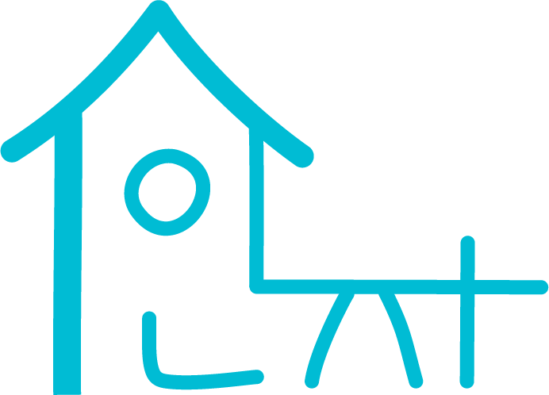

<!--
Hey, thanks for using the awesome-readme-template template.  
If you have any enhancements, then fork this project and create a pull request 
or just open an issue with the label "enhancement".

Don't forget to give this project a star for additional support ;)
Maybe you can mention me or this repo in the acknowledgements too
-->

<!--
This README is a slimmed down version of the original one.
Removed sections:
- Screenshots
- Running Test
- Deployment
- FAQ
-->

<div align="center">

  
  <h1>1인자 - NumberOne</h1>

  
<!-- Badges -->
<p>
  <a href="https://github.com/sweetSsun/NumberOne/graphs/contributors">
    
  </a>
  <a href="">
    
  </a>
  <a href="https://github.com/sweetSsun/NumberOne/network/members">
    
  </a>
  <a href="https://github.com/sweetSsun/NumberOne/stargazers">
    
  </a>
  <a href="https://github.com/sweetSsun/NumberOne/issues/">
    
  </a>
</p>
   
<h4>
    <a href="https://github.com/sweetSsun/NumberOne">Documentation</a>
  <span> · </span>
    <a href="https://github.com/sweetSsun/NumberOne/issues/">Report Bug</a>
  <span> · </span>
    <a href="https://github.com/sweetSsun/NumberOne/issues/">Request Feature</a>
  </h4>
</div>

<br />

<!-- Table of Contents -->
# :notebook_with_decorative_cover: 목차

- [프로젝트 소개](#star2-프로젝트-소개)
  * [기술](#space_invader-기술)
  * [기능](#dart-기능)
- [시작하기](#toolbox-시작하기)
  * [개발환경 구축](#bangbang-개발환경-구축)
  * [로컬에서 실행](#running-로컬에서-실행)
- [함께한 사람들](#handshake-함께한-)
  

<!-- About the Project -->
## :star2: 프로젝트 소개

<div align="center"> 
  
</div>


<!-- TechStack -->
### :space_invader: 기술

<details>
  <summary>Client</summary>
  <ul>
    <li>HTML5 / CSS3</li>
    <li>JavaScript(ES6)</li>
    <li>jQuery</li>
    <li>BootStrap</li>
  </ul>
</details>

<details>
  <summary>Server</summary>
  <ul>
    <li>Java11</li>
  </ul>
</details>

<details>
<summary>Database</summary>
  <ul>
    <li>Oracle</li>
  </ul>
</details>

<details>
<summary>Tool</summary>
  <ul>
    <li>Spring4</li>
    <li>Apache Tomcat 9</li>
  </ul>
</details>

<!-- Features -->
### :dart: 기능

- [x] 회원가입/카카오 계정으로 시작해보세요 ✨
- [x] 나의 예쁜 자취방 사진을 자랑게시판에 올려보세요 🏡
- [x] 자유/정보/질문/후기게시판을 통해 여러 사람과 소통해보세요 ✍️
- [x] 중고거래와 1:1 채팅으로 잘 사용하지 않는 물건을 정리하세요 🚚 
- [x] 공동구매를 통해 자취에 필요한 물품을 저렴하게 구매하세요 🛒


<!-- Getting Started -->
## 	:toolbox: 시작하기

<!-- Prerequisites -->
### :bangbang: 개발환경 구축

`Spring4`, `Oracle`, `Apache Tomcat 9` 가 필요합니다.

<!-- Run Locally -->
### :running: 로컬에서 실행

프로젝트 복사

```bash
  git clone https://github.com/sweetSsun/NumberOne.git
```


<!-- Contact -->
## :handshake: 함께한 사람들

<a href="https://github.com/sweetSsun">
  
</a>

Project Link: [https://github.com/LsweetSsun/NumberOne](https://github.com/sweetSsun/NumberOne)
